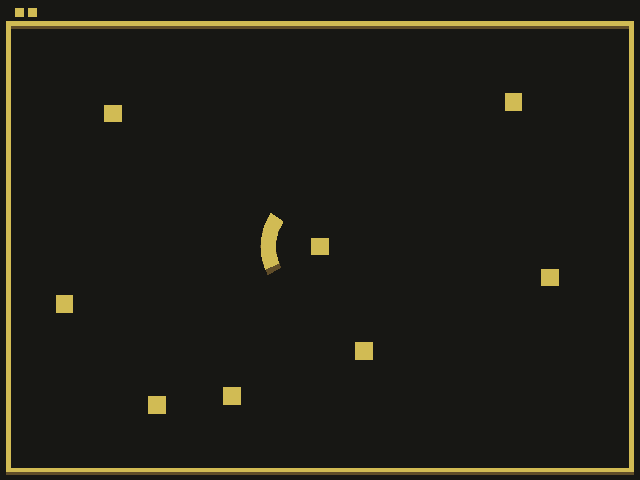

# Ball Defender

Author: Tyler Thompson

Design: You control an arc that rotates around a central square that you must protect from an increasing number of balls that speed up over time. This is a single-player game where your only obstacle is the physics of the bouncing balls!

Screen Shot:

How To Play:

The arc in the center that you use to defend your central square follows the mouse. Just move the mouse around the screen and the arc will spin around in a circle. Hitting with different parts of the arc will bounce the balls in different directions.

# Credits

This game was built with [NEST](NEST.md).

Additionally, while I did not copy any code from online, the following web pages were used as reference (mostly trigonometry, which I seemed to need help remembering):

https://www.khanacademy.org/computing/computer-programming/programming-natural-simulations/programming-vectors/a/vector-magnitude-normalization

https://math.stackexchange.com/questions/376090/calculate-pointsx-y-within-an-arc

https://www.google.com/search?client=firefox-b-1-d&q=get+angle+of+point+on+circle#kpvalbx=_6m9RX5W7F_ewytMPq6OeqAs31

https://www.programiz.com/cpp-programming/library-function/cmath/atan

https://www.quantstart.com/articles/Mathematical-Constants-in-C/

Note: Some of these web pages contain very small code chunks, but those weren't doing exactly what I needed and were just used as reference to build up to what I did need. Still, they deserve credit. Better safe than sorry with plagiarism. All of these references were used to help me code the NewMode.cpp file.
